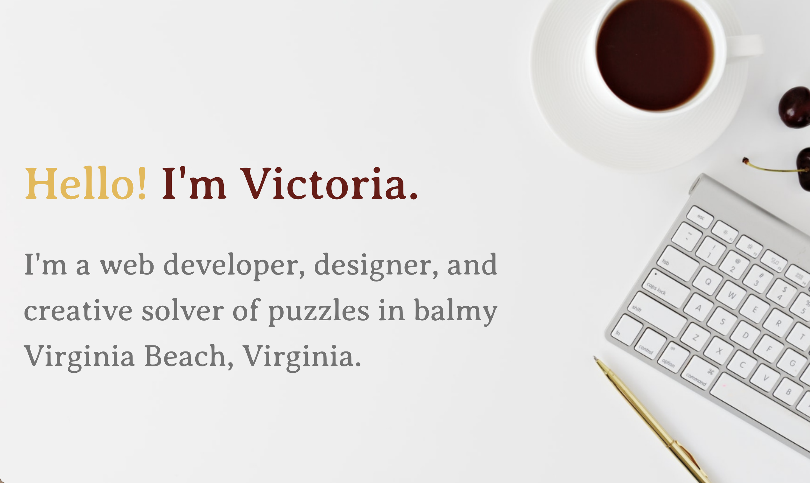

# Victoria Farr portfolio site

A simple portfolio site for a web developer with information for potential clients and employers about her skillset, portfolio of work, and contact information.

It can be viewed at: http://www.victoriahfarr.com/

## Prerequisites

- A simple, up-to-date browser than can read and display HTML5 & CSS is all that's needed. 🤓

## Contributors

The following contributed to this project:

- [@victoria-farr](https://github.com/Victoria-Farr) 🍊
- Desktop flat-lay photo 📸 by Leone Venter (https://unsplash.com/photos/VieM9BdZKFo)

## Contact

If you want to contact me you can reach me at [victoriafarr@gmail.com](mailto:victoriafarr@gmail.com)

## License

This project uses the following license: [Attribution-NonCommercial-NoDerivatives 4.0 International (CC BY-NC-ND 4.0)](https://creativecommons.org/licenses/by-nc-nd/4.0/).
